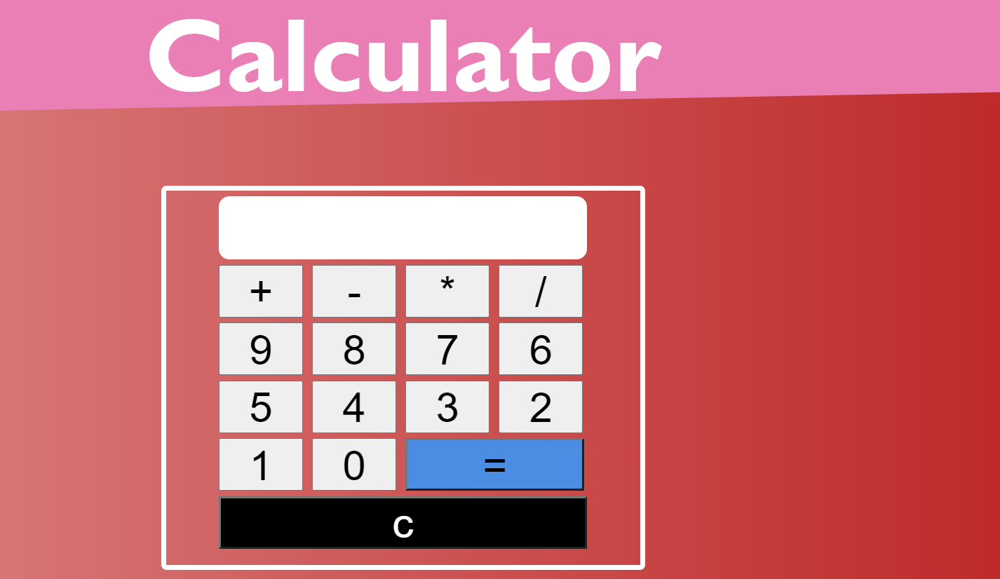

  **Calculator**
--------------------

A calculator is a device that performs arithmetic operations on numbers. The simplest calculators can do only addition, subtraction, multiplication, and division. More sophisticated calculators can handle exponential operations,roots,logarithms,trigonometric functions, and hyperbolic functions.

This is a very basic GUI Vanilla Js Calculator just made for basic calculation.  In addition to Javascript this project also uses the concepts of HTML and   CSS.For viewing the project please click on the link:https://github.com/MSCKIIT/MSCxHacktoberfest/tree/master/Calculator

Hope you like the project! 

