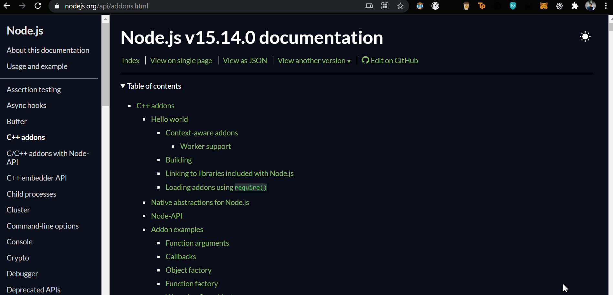

# URL-Minifier

 [](https://GitHub.com/Naereen/ama) [](https://code.visualstudio.com/) [](https://github.com/akashchouhan16/URL-Minifier/issues)
[](https://github.com/akashchouhan16/URL-Minifier/network) [](https://github.com/akashchouhan16/URL-Minifier/stargazers) 

A **Node** application to minify the URL links and save the minified urls to the **MongoDB** Database.

### **Dependencies**

- **shortid**
- **express**
- **mongoose**
- **ejs**
- **dotenv**

---

**Note :**
The **minified url** and the number of **visits** is fetched from the database, hence [Mongodb](https://www.mongodb.com/ "Visit MongoDB") must be installed onto the system and configured in order to run this application.

---

## How To Run the application? <code></code>

- **Clone this repo**
- **Install Dependencies**
  ```Node
    npm install
  ```
- **Create a `.env` file and save the connection URL for DB**
  ```
  MONGO_URI=<DB Connection URI>
  ```
- **Run the development server**
  ```Node
    npm run dev
  ```
- **Visit **http://localhost:5000** on your browser.**

## Preview



## [Application Info](https://github.com/akashchouhan16/Url-Shortener#readme "URL-Minifier")

### Version

[1.0.0](https://github.com/akashchouhan16/Url-Shortener#readme "Application version")

### License

[MIT License](./LICENSE "View License")
